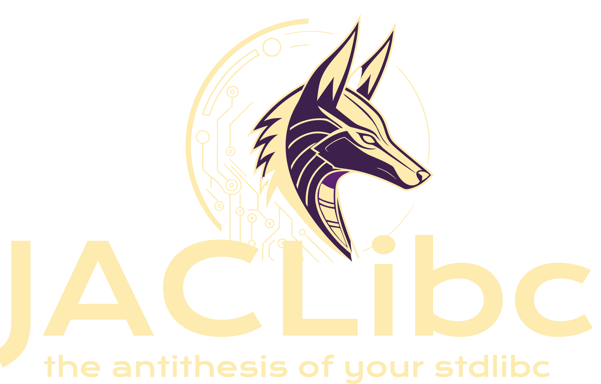

THis is a libc for WASM for those who lothe Emscripten and their build script monstrocity. This you can compile with `clang` without much fuss. There are a few gotchas but not like DEBUGGING EMSCRIPTEN. Also this generates ONLY WASM not webpages. However, to help you along there is a bootloader and SPA template available. But if you want all the tooling crap you should use `WACC` which was purpose built for JACL developpment.

# Compiling...

You should just be able to compile directly against this. However, there are a few flags that you should use to make things work optimal. The easiest thing to do is:

```bash
clang --nostdlib --include=path/to/jacl.h yourfile.c
```

However if you want a repeatable build we have the dockerfile and docker compose environments provided...

```bash
how to docker it...
```

# Compatability

Most of the libc should work regardless of what you do. obviously `jsio.h` is WASM teritory. However, we are trying to provide a full `stdlib` replacement so you should be able to do a lot.  Where possible we tried to use clang __builtins so that the resulting file would be as slim as can be. There are some flags for other compilers that have started making their way in but this is a long way from being ready to build with anything besides `clang`. Eventually I'd like to make it work with `XCC` although that means rewriting everything with builtins. We will probably get there eventually. `GCC` is not really on the horizon but I think most of the builtins should work. I just hate GNU bloat. `xcode` and `MSCC` may eventually make their way into the line up. But the next one is XCC for sure.

# Contributions

Pull requiests are welcome, but you will be assigning copyright to us. We don't maintain a list of contributours on the copyright. It's just FRINKnet and Friends. So consider your PR as a legally valid ESIGN that you are assigning copyright. If you have a problem with this fork and don't submit a PR. If you've done something cool and you don't push it upstream we may ask. But you have the power to say no. That's how the whole thing works.

JACL is a pet project born out of frustration and built with love and a lot of Perplexisty searches. If you like it, drop us a line and let us know...
